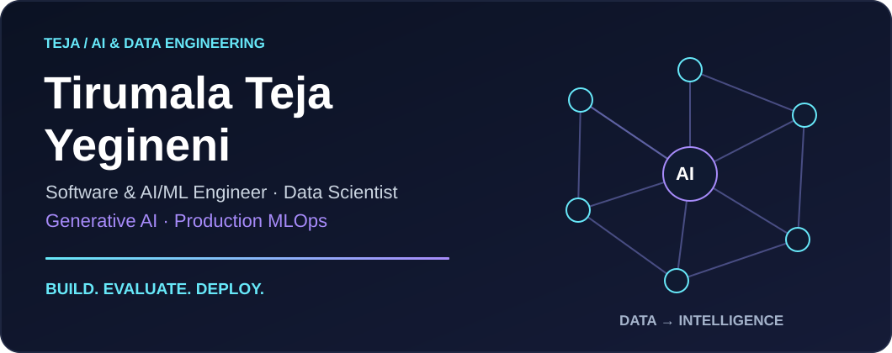
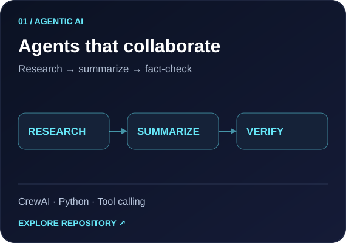
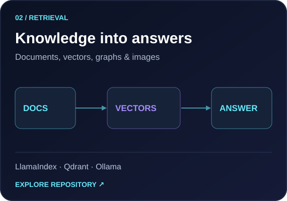
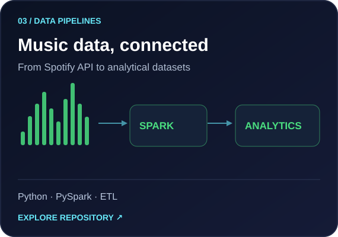
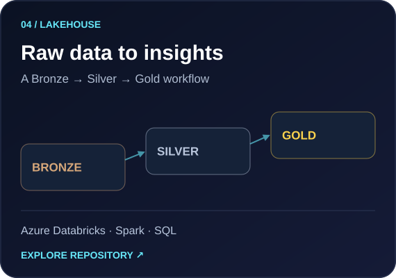
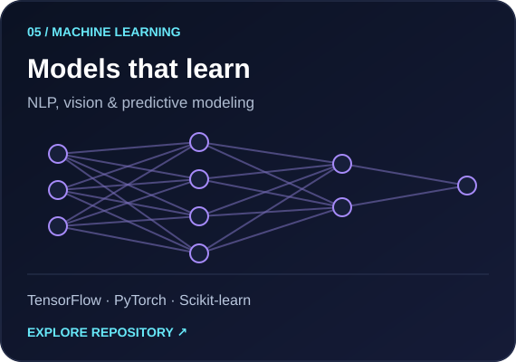
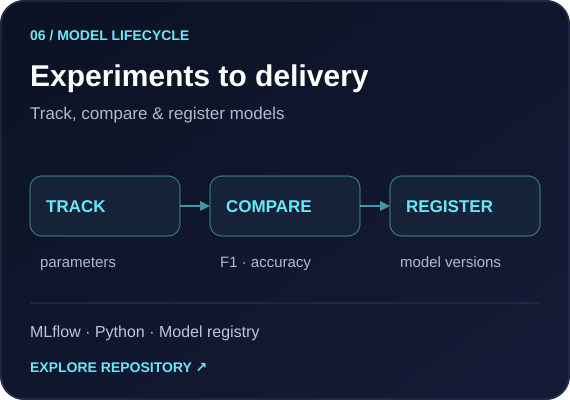

**5+ years in AI/ML · M.S. Data Science, University of North Texas**

I build AI applications, predictive models, and data pipelines — with evaluation and reliability at every step.

## Selected builds

<table>
<tr>
<td width="50%"></td>
<td width="50%"></td>
</tr>
<tr>
<td width="50%"></td>
<td width="50%"></td>
</tr>
<tr>
<td width="50%"></td>
<td width="50%"></td>
</tr>
</table>

**More builds:** [Air quality prediction](https://github.com/TIRUMALA9999/PM2.5_prediction_project) · [CNN classification](https://github.com/TIRUMALA9999/Convolution_Neural_Network) · [Python projects](https://github.com/TIRUMALA9999/python_files_and_projects)

## Technical toolkit

**🧠 AI / ML / GenAI**

**🗄️ Data Engineering & Databases**

**☁️ Cloud & DevOps**

**🌐 Web & APIs**

<b>View the full toolkit — modeling, software, evaluation & infrastructure</b>

Tools and concepts across professional work, applied projects, and continued learning.

| Area | Skills & tools |
| :--- | :--- |
| Programming & APIs | Python, SQL, Go, Bash, Git, YAML, FastAPI, Flask, Streamlit, Jupyter, REST APIs |
| Data science | NumPy, Pandas, EDA, statistics, hypothesis testing, feature engineering, Matplotlib, Seaborn, Power BI, Tableau |
| Machine learning | Scikit-learn, XGBoost, regression, decision trees, random forests, Naive Bayes, SVM, KNN, clustering, time series, cross-validation |
| Deep learning & NLP | PyTorch, TensorFlow, Keras, CNNs, MLPs, BERT, Word2Vec, Hugging Face, Transformers, spaCy, NLTK, transfer learning, augmentation, quantization |
| Generative & agentic AI | LangChain, LangGraph, LlamaIndex, CrewAI, CrewAI Flows, OpenAI API, Azure OpenAI, Ollama, prompt engineering, tool calling, agent memory, MCP / FastMCP |
| Retrieval systems | RAG, Qdrant, Neo4j, embeddings, chunking, semantic search, cross-encoder reranking, CLIP, multimodal RAG, Graph RAG |
| MLOps | MLflow, DVC, Weights & Biases, model registries, experiment tracking, GitHub Actions, CI/CD, canary and shadow deployments |
| Data engineering | Apache Spark, PySpark, Spark SQL, Azure Databricks, Delta Lake, ETL / ELT, medallion architecture, Snowflake, NoSQL, data modeling |
| Cloud & deployment | AWS, Azure, GCP, SageMaker, Azure ML, Vertex AI, S3, Lambda, Glue, Athena, Docker, Kubernetes, Terraform |
| Evaluation & operations | Precision, recall, F1, RMSE, MAE, groundedness evaluation, drift monitoring, CloudWatch, Prometheus, Grafana, latency and availability SLOs |
| GenAI foundations | Attention, tokenization, in-context learning, fine-tuning concepts, PEFT / LoRA concepts, hallucination mitigation, responsible AI |

## Repository map

Pick an area to explore projects, notebooks, and learning material.

<b>Machine learning & deep learning</b>

- [Machine Learning](https://github.com/TIRUMALA9999/Machine_Learning)
- [Deep Learning](https://github.com/TIRUMALA9999/Deep_Learning)
- [CNNs](https://github.com/TIRUMALA9999/Convolution_Neural_Network)
- [PyTorch](https://github.com/TIRUMALA9999/Pytorch)
- [NLP](https://github.com/TIRUMALA9999/Natural_Language_Processing)
- [Time Series](https://github.com/TIRUMALA9999/Time_series_forecasting)
- [Exploratory Data Analysis](https://github.com/TIRUMALA9999/Exploratory_Data_Analysis)
- [Statistics & Probability](https://github.com/TIRUMALA9999/Statistics_-_Probability)

<b>Generative AI & agents</b>

- [Agentic Systems](https://github.com/TIRUMALA9999/Agentic-Systems)
- [RAG](https://github.com/TIRUMALA9999/Retrieval_Augmented_Generation)
- [Generative AI Foundations](https://github.com/TIRUMALA9999/GenerativeAI)

<b>Python & software</b>

- [Python](https://github.com/TIRUMALA9999/Python)
- [Python Files & Projects](https://github.com/TIRUMALA9999/python_files_and_projects)
- [DSA with Python](https://github.com/TIRUMALA9999/DSA-with-Python)
- [FastAPI](https://github.com/TIRUMALA9999/Fast_API)
- [Flask](https://github.com/TIRUMALA9999/Flask)
- [Web Scraping](https://github.com/TIRUMALA9999/Web_Scraping)

<b>Data pipelines & analytics</b>

- [Spotify Pipeline](https://github.com/TIRUMALA9999/Spotify_Data_Pipeline_)
- [Apache Spark with Databricks](https://github.com/TIRUMALA9999/Apache_Spark_with_Databricks)
- [Azure E-Commerce Pipeline](https://github.com/TIRUMALA9999/E-Commerce-azure-data-engineering)
- [Snowflake](https://github.com/TIRUMALA9999/Snowflake)
- [SQL](https://github.com/TIRUMALA9999/Structured_Query_Language-SQL-)
- [Power BI](https://github.com/TIRUMALA9999/Power_BI)

<b>MLOps & infrastructure</b>

- [MLflow](https://github.com/TIRUMALA9999/MLflow)
- [DVC](https://github.com/TIRUMALA9999/Data_Version_Control)
- [Weights & Biases](https://github.com/TIRUMALA9999/Weights_and_Biases)
- [Docker](https://github.com/TIRUMALA9999/Docker)
- [Kubernetes](https://github.com/TIRUMALA9999/Kubernetes)
- [GitHub Actions](https://github.com/TIRUMALA9999/github-actions-bootcamp)
- [Prometheus & Grafana](https://github.com/TIRUMALA9999/Prometheus_and_Grafana)

<b>Education & certifications</b>

- M.S. Data Science — University of North Texas
- AWS Solution Architect Associate
- Azure AI Engineer Associate
- GCP Cloud Machine Learning Professional
- IBM Data Scientist Professional

---

**Let’s turn a useful idea into a working AI system.**

[Portfolio](https://tirumala9999.github.io/) · [LinkedIn](https://www.linkedin.com/in/tirumalatejayegineni/) · [Email](mailto:tirumalateja45@gmail.com)

